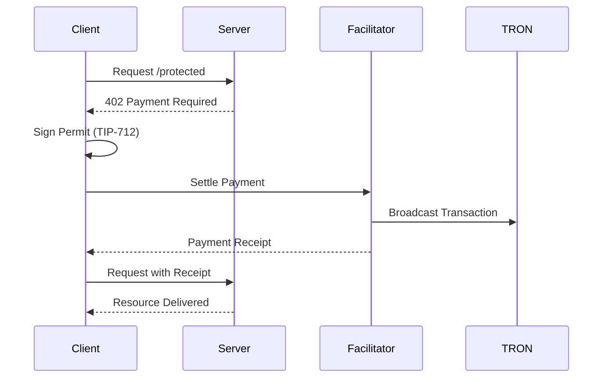

# Architecture

## Overview
This demo implements the **x402 payment protocol** to monetize resources on the TRON blockchain. It consists of three lightweight components interacting via HTTP and on-chain transactions.

## Workflow

## Components

| Component | Role | Tech Stack |
|-----------|------|------------|
| **Client** | Requests resources & signs payments | Python CLI / React + TronLink |
| **Server** | Hosts protected resources | Python (FastAPI) |
| **Facilitator** | Verifies & settles payments on-chain | Python (FastAPI) |
