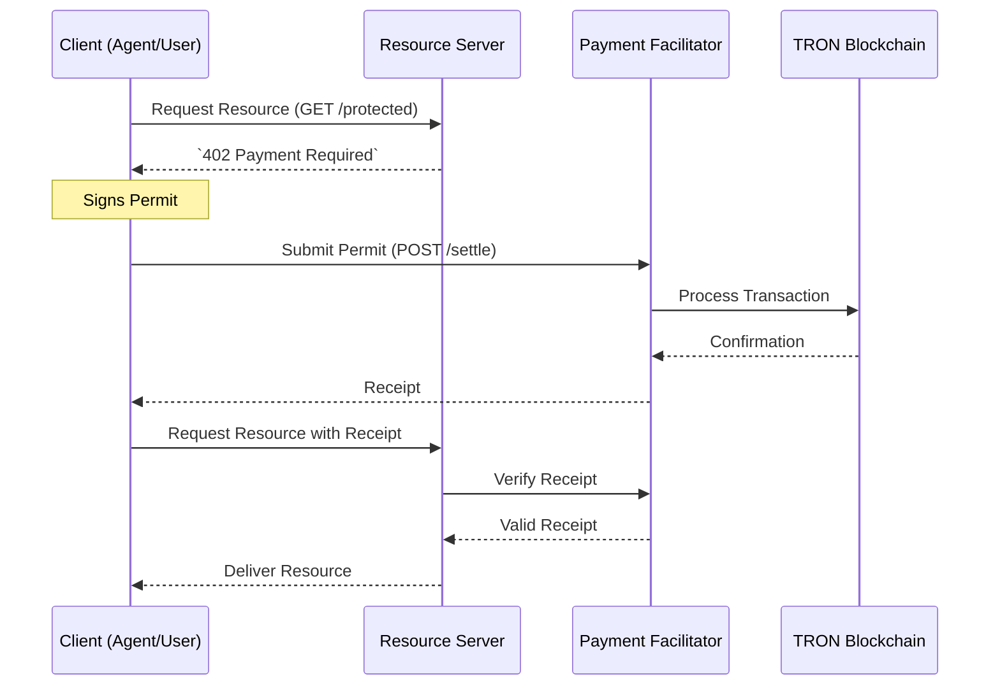

# System Architecture

## Overview

The X402-Tron ecosystem enables secure resource delivery via blockchain micropayments using the **x402 payment protocol**. The system comprises four key components: **Client**, **Resource Server**, **Payment Facilitator**, and **TRON Blockchain**.

---

## Table of Contents
1. [Component Diagram](#component-diagram)
2. [Core Components](#core-components)
3. [Communication Protocol](#communication-protocol)
4. [Data Flow](#data-flow)

---

## Component Diagram

Illustration of the system interactions:

---

## Core Components

### **Client**
- Sends resource requests.
- Handles payment permits.
- Includes CLI and Web Client implementations.

### **Resource Server**
- Protects resources using x402 protocol.
- Requires valid payment receipts for access.

### **Payment Facilitator**
- Validates permits (TIP-712 signatures).
- Settles transactions on the TRON blockchain.

### **TRON Blockchain**
- Processes and confirms payments.
- Ensures transaction immutability.

---

## Communication Protocol

The **x402 Protocol** merges HTTP 402 and blockchain micropayments to enforce pay-per-access transactions:

- **Permit-Based Authorization:** Payment permits act as cryptographic keys for access.
- **Blockchain-Powered Validation:** Combines decentralized ledger security with API-based workflows.

---

## Data Flow

1. **Client Requests Resource:** Initiates `402 Payment Required`.
2. **Permit Signing:** Client cryptographically signs payment details.
3. **Payment Settlement:** Facilitator processes payment via TRON.
4. **Resource Accessibility:** Server verifies payment receipt to deliver requested resources.