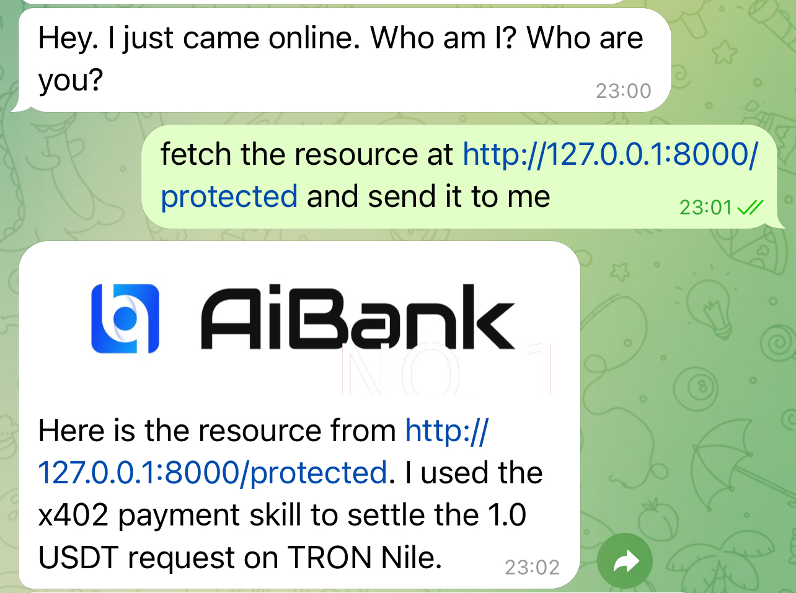

# X402-Tron Demo

## Overview

The **X402-Tron Demo** provides a practical demonstration of integrating the **x402 payment protocol** with the TRON blockchain. While not a fully-fledged application, this demo aims to showcase how decentralized micropayments can be used to enable pay-per-access workflows.

### Key Concept: Payment Workflow Simulation

The demo simulates a payment workflow involving three conceptual agents:
1. The **Client Agent** requests access to protected resources from the **Server Agent**.
2. Upon receiving a `402 Payment Required` challenge, the Client signs a cryptographic permit to meet payment requirements.
3. The **Facilitator Agent** validates the signed permit and settles the transaction on the TRON blockchain.
4. Once payment confirmation is complete, the Server delivers the requested resource.

Though the implementation relies on standard Python services, the demo is designed to illustrate the x402 payment flow conceptually. It demonstrates:
- Cryptographic payment permits (TIP-712 format).
- Blockchain transaction validation and settlement.

---

## Table of Contents
1. [Core Components](#core-components)
2. [Environment Setup](#environment-setup)
3. [Quick Start](#quick-start)
4. [License](#license)
5. [Additional Documentation](#additional-documentation)

---

## Core Components

### **Server: Resource Provider**
- **Purpose:** Hosts protected resources requiring blockchain-based payments.
- **Implementation:**
  - Verifies cryptographic payment receipts.
  - Securely delivers resources upon payment validation.

### **Facilitator: Payment Processor**
- **Purpose:** Intermediates payment validation and transaction settlement on the blockchain.
- **Implementation:**
  - Validates signed payment permits (TIP-712).
  - Settles micropayments using the TRON Nile Testnet.
- **Deployment:** Can be self-hosted (using this repository) or provided by an official service (*official address coming soon*).

### **Client: Resource Requester**
- **CLI Client:** Automates permit signing and resource retrieval workflows.
- **Web Client:** Offers a user-friendly interface for interacting with TronLink wallets.

---

## Environment Setup

### Prerequisites
- **Python 3.9+** (for local execution)
- **Node.js 18+** (for Web Client development)
- **Docker** (optional, for containerized deployment)

### Configuration
Before running the demo, create a `.env` file in the project root:

```env
# TRON private key for Facilitator's blockchain interactions.
TRON_PRIVATE_KEY=<your_tron_private_key>

# TronGrid API key for Facilitator TRON RPC access (required for reliable on-chain reads/writes, especially on `tron:mainnet`). Apply at https://www.trongrid.io/ (create an API key in the TronGrid Dashboard).
TRON_GRID_API_KEY=<your_trongrid_api_key>

# Payment recipient address for Server.
PAY_TO_ADDRESS=<server_recipient_tron_address>

# Service URLs (defaults)
SERVER_URL=http://localhost:8000
FACILITATOR_URL=http://localhost:8001
HTTP_TIMEOUT_SECONDS=60
```

Notes:
- If you enable `tron:mainnet`, the facilitator relies on TronGrid (or another TRON JSON-RPC endpoint) to build and broadcast transactions.
- Without a valid `TRON_GRID_API_KEY`, requests may fail with HTTP `429 Too Many Requests` due to rate limiting.

---

## Quick Start

### Step 1: Start X402 Service

Start the essential services (Facilitator and Server) to enable the x402 payment protocol:

**Using Scripts:**
```bash
# Start Facilitator
./start.sh facilitator

# Start Server (in a new terminal)
./start.sh server
```

**Using Docker:**
```bash
docker-compose up -d
```

### Step 2: Access and Payment via openclaw Agent

Once the services are running, the **openclaw** agent can automatically detect the `402 Payment Required` challenge, sign the necessary permits, settle  the payment via the facilitator, and retrieve the resource for you.

> Ensure the **openclaw** agent has the [openclaw-extension](https://github.com/open-aibank/openclaw-extension) (a suite of tools and skills developed by AIBank to empower AI Agents with financial sovereignty) enabled to handle x402 protocol operations.



---

## License

This project is open source under the **MIT License**. See the [LICENSE](LICENSE.md) file for more information.

---

## Additional Documentation

- **System Architecture:** Explore inter-component communication in [ARCHITECTURE.md](ARCHITECTURE.md).
- **Server Details:** Resource management info in [SERVER.md](SERVER.md).
- **Facilitator Details:** Payment processing insights in [FACILITATOR.md](FACILITATOR.md).
- **Client Details:** Instructions for CLI and web demo in [CLIENT.md](CLIENT.md).
